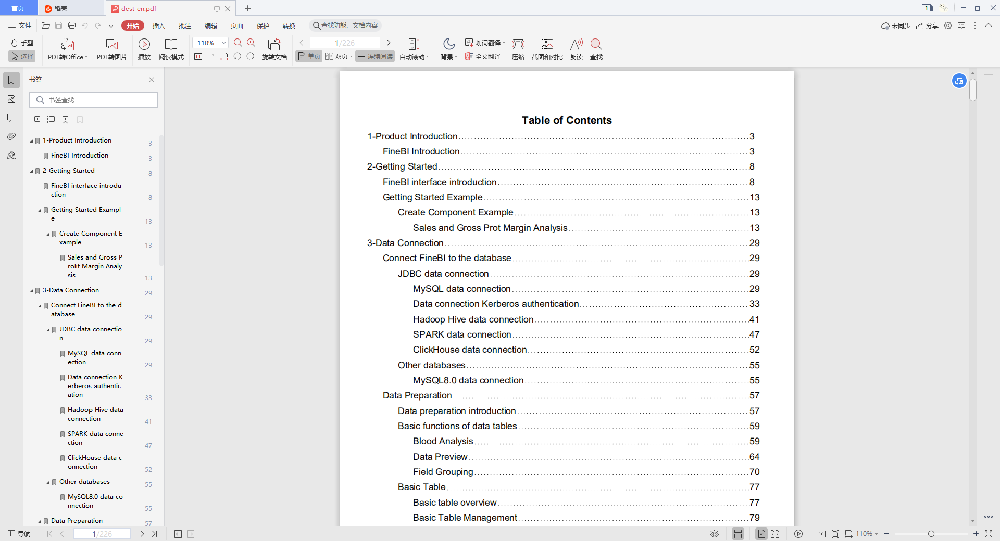

## 使用方式
~~~bash
java -jar app-1.0.jar -i <input path> -o <output path> [-otl] [-toc]
# [必选参数] -i 后面跟需要汇总的PDF的总文件夹 -o 后面跟输出的PDF文件名
# [可选参数] -otl 自动生成outline -toc 自动添加目录页
# e.g. java -jar app-1.0.jar -i d:/Work/temp/BI-doc-en -o d:/Work/temp/dest-en.pdf -toc -otl
~~~

## 效果
源文件夹结构：
~~~bash
├─1-Product Introduction
│      2.FineBI_Introduction.pdf
│
├─2-Getting Started
│  │  5.FineBI_interface_introduction.pdf
│  │
│  └─Getting Started Example
│      └─Create Component Example
│              15.Sales_and_Gross_Profit_Margin_Analysis.pdf
│              Ordersdetail.xlsx
│
├─3-Data Connection
│  ├─Connect FineBI to the database
│  │  ├─JDBC data connection
│  │  │      25.MySQL data connection.pdf
│  │  │      33.Data connection Kerberos authentication.pdf
│  │  │      36.Hadoop Hive data connection.pdf
│  │  │      65.SPARK data connection.pdf
│  │  │      80.ClickHouse data connection.pdf
│  │  │
│  │  └─Other databases
│  │          61.MySQL8.0 data connection.pdf
│  │
│  └─Data Preparation
│      │  20.Data_preparation_introduction.pdf
│      │
│      ├─Basic functions of data tables
│      │      28.Blood_Analysis.pdf
│      │      34.Data_Preview.pdf
│      │      70.Field_Grouping.pdf
│      │
│      ├─Basic Table
│      │  │  24.Basic_table_overview.pdf
│      │  │
│      │  ├─Basic Table Management
│      │  │      37.Update_Excel.pdf
│      │  │      52.Move_basic_table.pdf
│      │  │      54.Delete_basic_table.pdf
│      │  │
│      │  ├─Basic Table Operations
│      │  │      29.Edit_basic_table.pdf
│      │  │
│      │  └─Basic Table Types
│      │          31.Add_database_table.pdf
│      │          35.Add_SQL_dataset.pdf
│      │          42.Add_Excel_dataset.pdf
│      │
│      ├─Data Preparation FAQ
│      │      43. SQL_Dataset_Parameter_Definition.pdf
│      │
│      ├─Real-time data & extracted data
│      │      22.Real-time_data_(direct_connection).pdf
│      │
│      └─Storage management of data tables
│              21.Storage_of_Data_Tables.pdf
│              26.Package_Management.pdf
│              32.Group_Management.pdf
│
└─5-Build charts and analyze data
    ├─Add Interactions
    │  └─Other Components
    │          175.Text_Component.pdf
    │          209.Image_Component.pdf
    │
    ├─Data Analysis
    │  │  135.Add_calculation_indicator.pdf
    │  │
    │  └─Quick Calculation
    │          141.Quick_calculation_of_table.pdf
    │
    ├─Make Charts
    │  │  137.Chart_attributes.pdf
    │  │
    │  └─Chart Types
    │      └─Column Chart
    │              146.Column_chart.pdf
    │
    └─Map and geographic data analysis
        ├─Map related
        │      173.Geographic information.pdf
        │
        └─Map type
                153.Flow map.pdf
~~~
生成的PDF：

## 注意事项
1. 目前是将待合并PDF的第一行非空文本，作为合并后的子标题
2. 适用于待合并PDF本身没有Outline的情况，有Outline的情况没有测试过